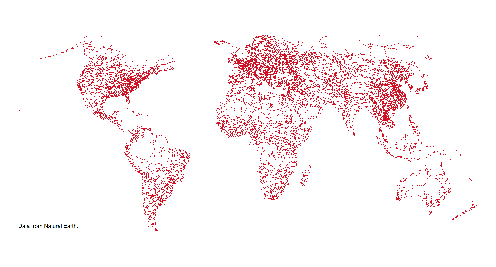

class: center, middle, hide-logo

```{r setup, include = F}
# This is the recommended set up for flipbooks
# you might think about setting cache to TRUE as you gain practice --- building flipbooks from scratch can be time consuming
options(width = 70)
knitr::opts_chunk$set(
  dev.args = list(bg = 'transparent'),
  fig.width = 12, message = TRUE, fig.showtext = TRUE,
  warning = FALSE, comment = "", cache = TRUE, fig.retina = 3
)
knitr::opts_knit$set(global.par = TRUE)
# remotes::install_github("luukvdmeer/sfnetworks")
# remotes::install_github("EvaMaeRey/flipbookr")
library(flipbookr)
library(xaringanthemer)
load('data/cuenca.rda')
```


```{r xaringan-themer, include = F}
style_mono_accent(
  # hex color should be provided, or theme_xaringan doesn't work
  base_color = '#ffa500', #orange
  title_slide_background_image = "figs/milano.png",
  background_image = "figs/milano_bg.png",
  code_font_size = '14px',
  text_slide_number_color = '#b3b3b3', #grey70
  link_color = '#ff4500', #orangered  
  footnote_font_size = '0.5em',
  footnote_position_bottom = "30px",
  code_highlight_color = "#ffedcc", #faded-orange
  extra_css = list(
    ".pull-left-70" = list("float" = "left", "width" = "65.8%"),
    ".pull-right-30" = list("float" = "right", "width" = "28.2%"),
    ".pull-left-30" = list("float" = "left", "width" = "28.2%"),
    ".pull-right-70" = list("float" = "right", "width" = "65.8%"),
    ".orange" = list("color" = "#ffa500"),
    ".note" = list("font-size" = "0.8em", "position" = "absolute", 
      "bottom" = "30px", "padding-right" = "4em")
  )
)
```

```{r color, echo = FALSE, results='asis'}
# crayon needs to be explicitly activated in Rmd
options(crayon.enabled = TRUE)
# Hooks needs to be set to deal with outputs
# thanks to fansi logic
old_hooks <- fansi::set_knit_hooks(knitr::knit_hooks,
                                   which = c("output", "message", "error"))
```

```{r, include = F, eval = F}
# Code to create scrolling bar / not working good with flipbookr
# ```{css, echo=FALSE}
# pre {
#   max-height: 90%;
#   overflow-y: auto;
#   background-color: inherit;
# }
# 
# pre[class] {
#   max-height: 50%;
# }
# ```
```

```{r ggplottheme, include = F}
library(ggplot2)
themeX = theme_set(theme_xaringan(text_font_size = 18, title_font_size = 22))
themeV = theme_set(theme_void())
theme_set(themeV)
theme_update(
  axis.ticks = element_line(color = 'grey70'),
  panel.grid = element_line(color = 'grey70', linetype = 'dotted', size = 0.5),
  legend.background = element_rect(fill = "transparent"),
  panel.background = element_rect(fill = "transparent"),
  plot.background = element_rect(fill = "transparent", color = NA)
)
```
### Primero lo primero...

Encuentran las diapositivas de la presentación aquí: https://sfnetworks.github.io/sfnetworks-REspacialES/slides
 
...

y el código fuente en este repositorio de GitHub: https://github.com/sfnetworks/sfnetworks-REspacialES

---
class: center, middle, hide-logo

## ¿De qué les voy a hablar hoy?

Redes geoespaciales en R (sinópsis)

Paquete `{sfnetworks}`: origen, filosofía, estructura

Recorrido por las funciones de `{sfnetworks}`, incluyendo:<br>
  Las funciones base del paquete<br>
  Nuevas funciones en `{sfnetworks}` v.0.4.1 "Hiltrup"

---
class: center, middle, hide-logo

## ¿Qué son redes geoespaciales?

.pull-left[
Redes viales

]

.pull-right[
Redes fluviales

]
---
class: center, middle, hide-logo

## La oferta en R:

--

.pull-left[
### Análisis espacial

[\#rspatial](https://twitter.com/search?q=%23rspatial)

`sf`

`stars`

`rgeos`

`rgdal`

`tmap`

`ggmap`

`mapview`

...
]

.pull-right[
### Análisis de redes

[statnet](http://statnet.org/)

`igraph`

`tidygraph`

`qgraph`

`ggraph`

`visNetwork`

`networkD3`

...
]

---
class: center, middle, hide-logo

# ¿Y para redes espaciales?

--

[dodgr](https://atfutures.github.io/dodgr/) 

[cppRouting](https://github.com/vlarmet/cppRouting)

[shp2graph](https://r-forge.r-project.org/projects/shp2graph)

[spnetwork](https://github.com/edzer/spnetwork)

[stplanr](https://docs.ropensci.org/stplanr/)

...

---
class: center, middle, hide-logo
## Nuestra propuesta

--
.pull-left[

]

--

.pull-right[

]
--
.center[

]

---
class: middle, hide-logo

.pull-left-70[
.center[

]
.footnote[
Arte de [@allison_horst](https://twitter.com/allison_horst)
]
]

.pull-right-30[
### Datos *tidy*

1. Cada variable forma una columna.
2. Cada observación forma una fila.
3. Cada unidad observacional forma una tabla.

.footnote[
Wickham, H. (2014). Tidy Data. Journal of Statistical Software, 59(10), 1 - 23. doi:http://dx.doi.org/10.18637/jss.v059.i10
]

<br>

- Implementado en los paquetes *tidyverse*

- Permite estructuras concatenables `%>%` 

- Más info en la charla de [REspacialEs aquí!](https://youtu.be/qm_30hOnocg)

]

---
class: center, middle, hide-logo

.pull-left-70[

.footnote[
Artwork by [@allison_horst](https://twitter.com/allison_horst)
]
]

.pull-right-30[

### ** Paquete `sf`**

Simple features para R

Datos espaciales vectorials (puntos, líneas, polígonos)

Compatible con los flujos *tidy* 

Clases S3 
]
---
class: center, middle, hide-logo

.pull-left-70[

.footnote[
Figura de [R Graph Gallery](https://www.r-graph-gallery.com/314-custom-circle-packing-with-several-levels.html)
]
]

.pull-right-30[

### **Paquete `tidygraph`**

 Interfaz con [`igraph`](https://igraph.org/r/)  
 

 Soporte para *verbos* [`dplyr`](https://dplyr.tidyverse.org/) 


 Introduce nuevos *verbos* específicos para datos de redes (e.g. `morph`, `bind_graphs`, `graph_join`)


 Permite visualizción a través de  [`ggraph`](https://ggraph.data-imaginist.com/)
]
---
class: center, middle
# ¿Y `sfnetworks`?

--

### Filosofía
  
De la introducción de `tidygraph`: 
  
  > "... una cercana aproximación de datos *ordenados* para datos relacionales son dos *tidy data frames*, uno que describa los *nodos* y otro describiendo las *aristas*."

--
  
  <br>
  <br>
  
  > “Una cercana aproximación de datos *ordenados* para datos relacionales .orange[*geoespaciales*] son dos .orange[*objectos sf*], uno que describa los *nodos* y otro describiendo las *aristas*”

adaptación para `sfnetworks`.

---
class: middle
## Instalación

Instalación estable desde GitHub en la rama `master`: 
  
  ```{r, eval = F}
remotes::install_github("luukvdmeer/sfnetworks")
```

Instalación de la rama `develop` donde desarrollamos activamente el paquete y PR pueden ser dirigidas: 
  
  ```{r, eval = F}
remotes::install_github("luukvdmeer/sfnetworks", ref = "develop")
```
---
class: middle
## Estructura de la clase `sfnetwork`

### Construcción
  
Nodos: objeto `sf` con geometrías `POINT`

Aristas: Columnas *to*, *from* y coordenadas de borde.

Mismo sistema de coordenas!
  
---
`r chunk_reveal(chunk_name = "toyexample", break_type = "user", display_type = "both", title = "### Construcción")`

```{r toyexample, include = F}
library(sf)
library(sfnetworks)

p1 = st_point(c(7, 51))
p2 = st_point(c(7, 52))
p3 = st_point(c(8, 52))

st_sfc(
  p1, p2, p3,
  crs = 4326
) %>% st_sf() -> #BREAK
  nodes #BREAK

st_sfc(
  st_cast(st_union(p1,p2), "LINESTRING"),
  st_cast(st_union(p1,p3), "LINESTRING"),
  st_cast(st_union(p2,p3), "LINESTRING"),
  crs = 4326
) %>% st_sf() -> #BREAK
  edges #BREAK

edges$from = c(1, 1, 2)
edges$to = c(2, 3, 3) #BREAK

sfnetwork(nodes, edges, directed = FALSE) -> #BREAK
  net #BREAK

class(net)
```

---
`r chunk_reveal(chunk_name = "toyexamplename", break_type = "user", display_type = "both", title = "### Tip extra!")`

```{r toyexamplename, include = F}
nodes$name = c("city", "village", "farm")
edges$from = c("city", "city", "village")
edges$to = c("village", "farm", "farm") #BREAK

sfnetwork(nodes, edges, node_key = "name")
```

---
class: middle
## Estructura de la clase `sfnetwork`

### Conversión
  
Usando `as_sfnetwork()` se pueden pasar objetos de tipo:
- `sf` con geometría `POINT` o `LINESTRING`
- `tbl_graph` de `tidygraph`
- `psp` o `linnet` de `spatstat`
- `sfNetwork` de `stplanr`

--

Archivos externos que se puedan leer con: 
- `sf::st_read()`
- `igraph::read_graph() %>% as_tbl_graph()` 

---
#### Demo: Librerías

```{r demo1, eval = F}
library(sf)
library(sfnetworks)
library(tidygraph)
library(tidyverse)

# Extras:
library(ggplot2) 
```

---
#### Demo: Datos

.center[
```{r demo2, echo = F}
ggplot() +
  geom_sf(data = roxel)
```
]

---
#### Demo: Datos

.center[
```{r demo3, echo = F, fig.width = 12}
ggplot() +
  geom_sf(data = cuenca)
```
]

---
`r chunk_reveal(chunk_name = "demo4", break_type = "rotate", display_type = "both", width = c(33, 68, 0), title = "#### Demo: Conversión")`

```{r demo4, include = F}
cuenca %>% 
  head() %>% #ROTATE
  as_sfnetwork() #ROTATE
```

---
`r chunk_reveal(chunk_name = "demo5", break_type = "non_seq", display_type = "both", width = c(33, 68, 0), title = "#### Demo: Conversión")`

```{r demo5, include = F}
cuenca %>% 
  as_sfnetwork(
    directed = F, #BREAK2
    edges_as_lines = F #BREAK3
  ) #BREAK

net = as_sfnetwork(cuenca, directed = F) #BREAK4
```

---
`r chunk_reveal(chunk_name = "demo6", break_type = "user", display_type = "both", title = "#### Demo: Visualización")`

```{r demo6, include = F}
par(mar = c(0,0,0,0)) #BREAK
plot(net) 
```

---
`r chunk_reveal(chunk_name = "demo7", break_type = "user", display_type = "both", title = "#### Demo: Visualización")`

```{r demo7, include = F}
autoplot(net) + #BREAK
  ggtitle("Red vial de Cuenca, Ecuador")
```

.note[[Issue en ggraph](https://github.com/thomasp85/ggraph/issues/275)]

---
`r chunk_reveal(chunk_name = "demo8", break_type = "user", display_type = "both", title = "#### Demo: Wrangling")`

```{r demo8, include = F}
# Con verbos de `dplyr`
net %>% #BREAK
  activate("edges") %>% #BREAK
  filter(type == "residential")
```

---
`r chunk_reveal(chunk_name = "demo9", break_type = "user", display_type = "both", title = "#### Demo: Wrangling")`

```{r demo9, include = F}
par(mar = c(0,0,0,0), mfrow = c(2,1))
plot(net, col = 'grey') #BREAK
plot(
  sansebas, 
  border = 'red', lwd = 2, 
  col = NA, add = T
) #BREAK
plot(
  st_filter(
    net, 
    sansebas, 
    .predicate = st_intersects
  )
)
```

---
`r chunk_reveal(chunk_name = "demo10", break_type = "user", display_type = "both", title = "#### Demo: Wrangling")`

```{r demo10, include = F}
# Con funciones de tidygraph
net %>%
  activate("nodes") %>% #BREAK
  mutate(centrality = centrality_betweenness())
```

---
`r chunk_reveal(chunk_name = "demo11", break_type = "non_seq", display_type = "both", title = "#### Demo: Wrangling")`

```{r demo11, include = F}
# Funciones especificas para redes espaciales
net %>%
  activate("edges") %>%
  select(to, from, geometry) %>% 
  mutate(
    length = edge_length(), #BREAK2
    azimuth = edge_azimuth() #BREAK3
  )#BREAK
```

---
`r chunk_reveal(chunk_name = "demo13", break_type = "non_seq", display_type = "both", title = "#### Demo: Preprocesamiento")`

```{r demo13, include = F}
net %>% 
  st_filter(gilramir, .predicate = st_intersects) %>% 
  convert(to_spatial_subdivision) %>% #BREAK2
  convert(to_spatial_smooth) %>% #BREAK3
  convert(to_spatial_simple) %>% #BREAK4
  plot() #BREAK
```

---
`r chunk_reveal(chunk_name = "demo14", break_type = "user", display_type = "both", title = "#### Demo: Preprocesamiento")`

```{r demo14, include = F}
net %>% #BREAK
  convert(to_spatial_subdivision) %>%
  convert(to_spatial_smooth) %>% 
  convert(to_spatial_simple) -> #BREAK
  net_clean
```

---
`r chunk_reveal(chunk_name = "demo15", break_type = "user", display_type = "both", title = "#### Demo: Ruteo")`

```{r demo15, include = F}
parque = st_sfc(st_point(c(-79.0044, -2.8977)), crs = 4326)
artes = st_sfc(st_point(c(-79.0252, -2.9203)), crs= 4326)
estadio = st_sfc(st_point(c(-79.00586, -2.90672)), crs= 4326) #BREAK

st_network_paths(
  net_clean, 
  from = parque, 
  to = c(artes,estadio)
) -> #BREAK
  paths

paths %>% 
  pull(node_paths) %>% 
  unlist() #BREAK
```

---
`r chunk_reveal(chunk_name = "demo18", break_type = "user", display_type = "both", title = "#### Demo: Ruteo")`
```{r demo18, include = F}
plot_path = function(node_path) {
  net_clean %>%
    activate("nodes") %>%
    slice(node_path) %>%
    plot(cex = 1.5, lwd = 1.5, add = TRUE)
} #BREAK

par(mar = c(0,0,0,0), mfrow = c(1,1))
plot(net_clean, col = 'grey') #BREAK
plot(parque, col = "blue", pch = 8, add = T)
plot(artes, col = "red", pch = 8, add = T)
plot(estadio, col = "orange", pch = 8, add = T) #BREAK
paths %>%
  pull(node_paths) %>%
  purrr::walk(plot_path)
```

---
`r chunk_reveal(chunk_name = "demo16", break_type = "user", display_type = "both", title = "#### Demo: Isocronas")`

```{r demo16, include = F}
net_clean %>%
  activate("edges") %>%
  pull(type) %>%
  unique() -> #BREAK
  types

# Randomly define a walking speed in m/s for each type,
# with values between 3 and 7 km/h.
set.seed(1)
speeds = runif(
  length(types), 
  3 * 1000 / 60 / 60, 
  7 * 1000 / 60 / 60
) #BREAK

# Assign a speed to each edge based on its type.
# Calculate travel time for each edge based on that.
net_clean %>%
  activate("edges") %>%
  select(type) %>% 
  mutate(weight = edge_length()) %>% 
  group_by(type) %>%
  mutate(speed = units::set_units(speeds[cur_group_id()], "m/s")) %>%
  mutate(time = weight / speed) %>%
  ungroup() %>% #BREAK
  activate("nodes") ->
  net_clean 
```

---
`r chunk_reveal(chunk_name = "demo17", break_type = "user", display_type = "both", title = "#### Demo: Isocronas")`
```{r demo17, include = F}
net_clean %>%
  filter(
    node_distance_from(
      st_nearest_feature(parque, net_clean), 
      weights = time) <= 600
  ) -> #BREAK
  iso

iso_poly = iso %>%
  st_geometry() %>%
  st_union() %>%
  st_convex_hull() #BREAK

par(mar = c(0,0,0,0), mfrow = c(1,1))
plot(net_clean, col = "grey") #BREAK
plot(
  iso_poly, 
  col = NA, border = "black", 
  lwd = 3, add = TRUE) #BREAK
plot(iso, 
     col = "lightsalmon", 
     add = TRUE) #BREAK
plot(parque, col = "blue", 
     pch = 8, cex = 2, 
     lwd = 2, add = TRUE)
```

---
`r chunk_reveal(chunk_name = "demo12", break_type = "user", display_type = "both", title = "#### Demo: Detección de comunidades")`

```{r demo12, include = F}
net_clean %>% #BREAK
  morph(to_linegraph) %>% #BREAK
  mutate(group = group_louvain()) %>% #BREAK
  unmorph() -> #BREAK
  grouped_net

grouped_net %>%
  activate("edges") %>%
  pull(group) %>%
  unique() %>%
  length() #BREAK

par(mar = c(0,0,0,0), mfrow = c(1,1))
plot(
  st_geometry(net, "edges"), 
  col = "grey", lwd = 0.5
) #BREAK

grouped_net %>%
  activate("edges") %>%
  st_as_sf() %>%
  transmute(group = as.factor(group)) %>%
  filter(group %in% c(1:20)) %>%
  plot(lwd = 4, add = TRUE) 
```

---
class: center, middle

### ¿Quieren más?

--

Pueden encontrar documentación y más ejemplos en la [página del paquete](https://luukvdmeer.github.io/sfnetworks/index.html)

--

### ¿Tienen sus propios ejemplos o ideas sobre el paquete?

--

Unánse a la [Discusión en GitHub](https://github.com/luukvdmeer/sfnetworks/discussions)

--

### ¿Encontraron un bug?

--

Hágannos saber en un [issue aquí](https://github.com/luukvdmeer/sfnetworks/issues)!


---
class: center, middle

### ¡Gracias por su atención!

#### ¿Preguntas?

.note[.pull-left[Proyecto financiado por:<br>]

.pull-right[Presentación construida con [xaringan](https://github.com/yihui/xaringan), [xaringanthemer](https://github.com/gadenbuie/xaringanthemer) y [flipbookr](https://github.com/EvaMaeRey/flipbookr)]]
